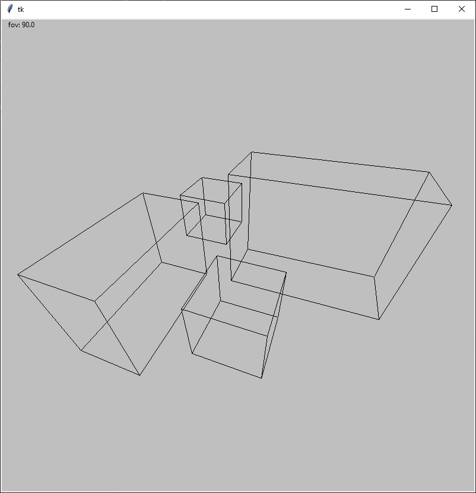

# GK - projekt 1 - Wirtualna kamera
Projekt z kursu Grafika Komputerowa na Politechnice Warszawskiej w semestrze letnim 2024. Celem projektu było stworzenie wirtualnej kamery z możliwością poruszania się po scenie (translacje i rotacje) oraz z możliwością przypliżania (zmiany kąta widzenia). Projekt nie zawiera eliminacji elementów zasłoniętych.

W programie użyty został jedynie układ współrzędnych kamery. Wszystkie obiekty (prostopadłościany) definiowane są właśnie w nim a transformacje kamery symulowane są poprzez transformacje wszystkich obiektów na scenie w przeciwnych kierunkach.

## Uruchomienie
``pip install -r requirements.txt``

``python main.py``

## Sterowanie:
↑ ↓ 	- ruch wyżej / niżej (względem osi y)\
←→  	- ruch prawo / lewo (względem osi x)\
z x	- ruch bliżej / dalej (względem osi z)\
a d 	- obrót względem osi y\
w s	- obrót względem osi x\
q e 	- ogrót względem osi z\
r f	- zmiana kąta widzenia (jego wartość wyświetlana jest w lewym górnym rogu ekranu)

## Zrzut ekranu

